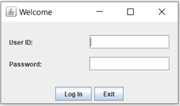
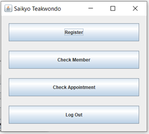
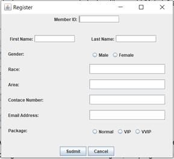
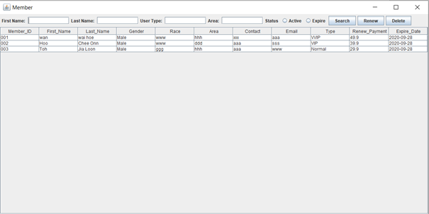
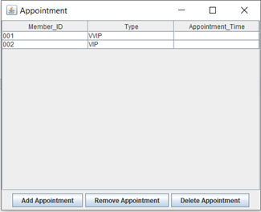

# Java Taekwondo Academy System

This is a simple **Taekwondo Academy Management System** developed in Java using Netbeans as part of my academic project.

## Features

- Admin Login
- New member registration
- Search Filter and user listing
- Delete user
- Renew user package
- Add appoinment for VIP and VVIP users
- Cancel appoinment
- Log out

## Technologies Used

- Java (Netbeans)
- Object Oriented Programming (OOP)

## Screenshots

- **Login Page**

  

- **Menu Page**

  

- **New Member Registrarion**

  

- **Member Management Page**

  

- **Appointment Management Page**

  
